# euVWA - Extended Vulnerable Web Application

Este repositorio contiene la aplicación euVWA, desarrollada con Node.js, Express y SQLite, cumpliendo con los requisitos de la asignatura de Desarrollo Seguro de Aplicaciones.

El proyecto está dividido en dos ramas principales:
*   **main-vulnerable:** Contiene la aplicación con 8 vulnerabilidades intencionadas del OWASP Top 10.
*   **main-secure:** Contiene la misma aplicación, pero aplicando prácticas de Secure Coding.

## 1. Instrucciones de Instalación y Ejecución

Para ejecutar cualquiera de las dos versiones, los pasos son los siguientes:

1. Clonar el repositorio y acceder a la carpeta:
   \`\`\`bash
   git clone (https://github.com/Saiker69420/euVWA)
   cd euVWA
   \`\`\`
2. Instalar las dependencias de Node.js:
   \`\`\`bash
   npm install
   \`\`\`
3. (Opcional) Cambiar entre versiones usando Git:
   * Para probar la versión vulnerable: \`git checkout main-vulnerable\`
   * Para probar la versión segura: \`git checkout main-secure\`
4. Iniciar el servidor web:
   \`\`\`bash
   node app.js
   \`\`\`
5. Abrir un navegador web y acceder a: \`http://localhost:3000\`

---

## 2. Tabla Comparativa de Vulnerabilidades

A continuación se detalla la explicación técnica de los fallos y sus correcciones:

| Vulnerabilidad (OWASP) | Versión Vulnerable | Versión Segura (Corrección Aplicada) |
| :--- | :--- | :--- |
| **1. XSS Reflejado** | El servidor inyecta el input del usuario (`req.query`) directamente en la respuesta HTML sin filtrarlo. | Se ha creado una función `escapeHTML()` que convierte caracteres peligrosos (`<, >, &, ',"`) en entidades HTML antes de renderizarlos. |
| **2. XSS Almacenado** | Los datos extraídos de la base de datos se inyectan en el HTML del foro sin ningún tipo de sanitización. | Se aplica la función `escapeHTML()` a cada registro extraído de la base de datos antes de incrustarlo en la respuesta web. |
| **3. Inyección SQL (SQLi)** | Las consultas a SQLite se construyen concatenando directamente el input del usuario como un string. | Se utilizan **Consultas Parametrizadas** (Prepared Statements) con `?`, separando la estructura lógica de la consulta de los datos introducidos. |
| **4. Command Injection** | Se usa `exec()` concatenando directamente la entrada del usuario a un comando del sistema (`ping`). | Se ha implementado una validación estricta usando una Expresión Regular (Regex) que solo permite el formato exacto de una dirección IPv4. |
| **5. IDOR** | La ruta de perfil asume que el ID solicitado en la URL pertenece al usuario legítimo, sin verificar la autorización. | Se aplica control de acceso: el servidor comprueba que el ID de la URL coincide exactamente con el ID del usuario autorizado en sesión antes de hacer la consulta. |
| **6. Sensitive Data Exposure** | La API realiza un `SELECT *`, enviando al cliente toda la estructura de la tabla, incluyendo contraseñas. | Se filtran explícitamente las columnas en la consulta SQL (`SELECT id, username, account_balance`), evitando extraer y enviar la columna `password`. |
| **7. Security Misconfig.** | Los bloques `catch` devuelven el `error.stack` al cliente, revelando rutas internas del servidor. | Se intercepta el error para guardarlo en un log interno (`console.error`), y se devuelve un mensaje genérico al usuario (Código HTTP 500). |
| **8. Broken Authentication**| Las contraseñas de los usuarios se guardan en la base de datos en texto plano. | Se utiliza la librería **bcrypt** para generar un hash criptográfico con un factor de coste de 10 antes de guardar la contraseña en SQLite. |

---

## 3. Demostración de Explotación (Rama Vulnerable)

A continuación se evidencian las 8 vulnerabilidades explotadas con éxito en la versión insegura:

### 1. XSS Reflejado
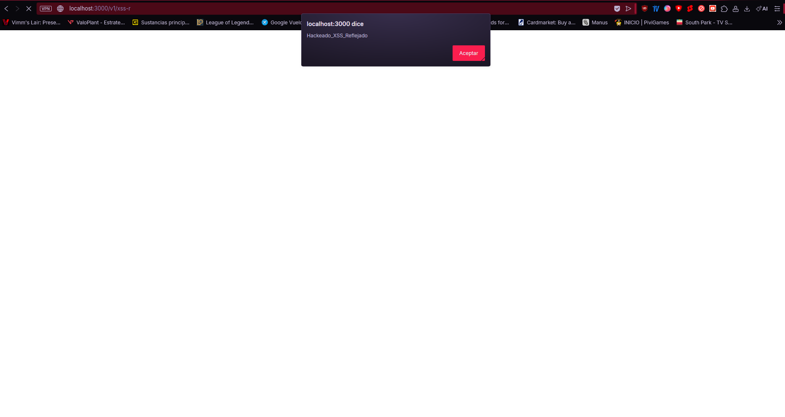

### 2. XSS Almacenado
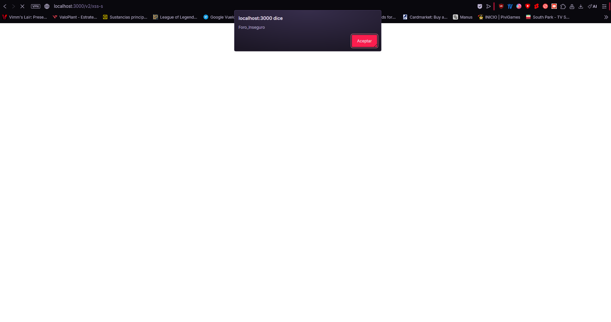

### 3. Inyección SQL (SQLi)
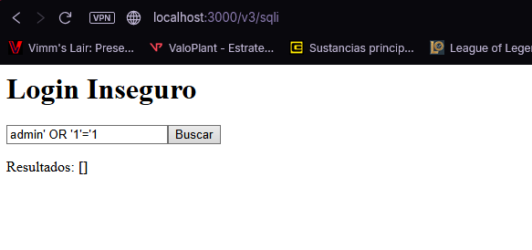
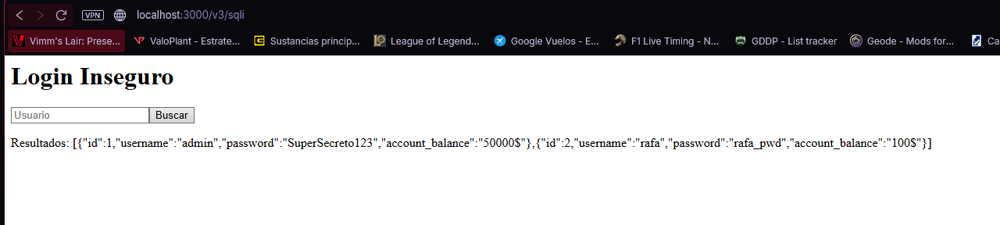

### 4. Command Injection
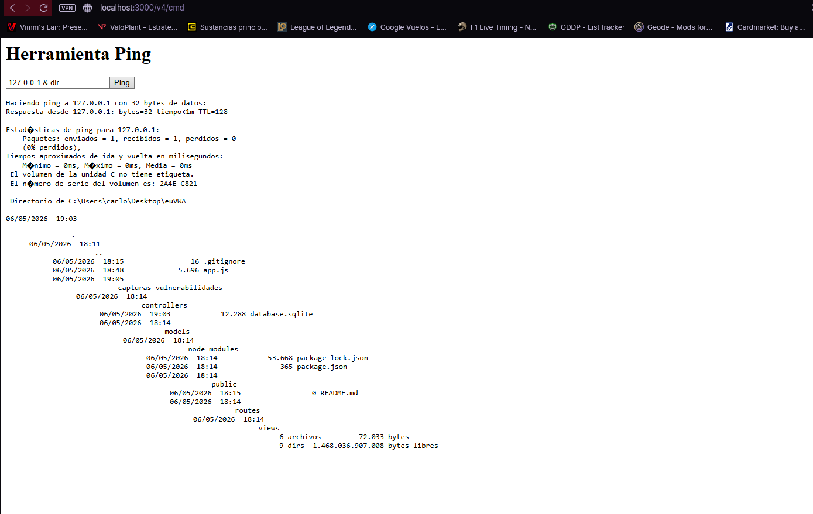

### 5. IDOR (Insecure Direct Object Reference)
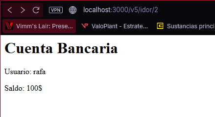
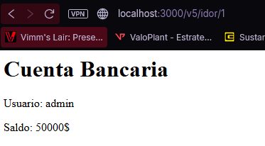

### 6. Exposición de Datos Sensibles
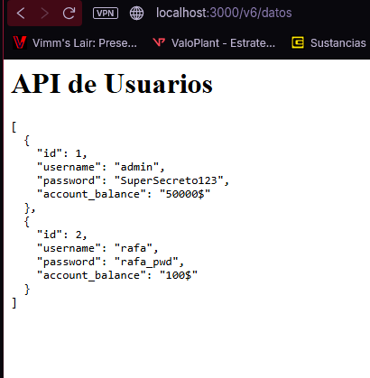

### 7. Configuración de Seguridad Incorrecta
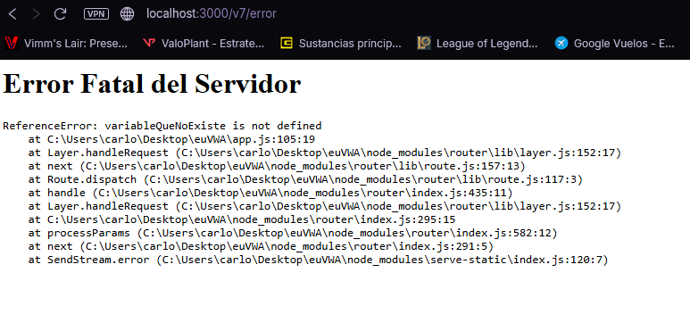

### 8. Autenticación Rota
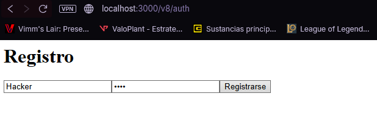
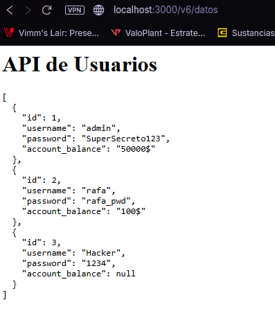

# Informe Ejecutivo DevSecOps - euVWA

Este documento detalla la implementación del pipeline CI/CD de seguridad (DevSecOps) para la aplicación euVWA, integrando controles automatizados desde el código hasta el despliegue.

## 1. Fases del Pipeline y Herramientas (Shift Left)

El pipeline de GitHub Actions se compone de 4 fases de seguridad automatizadas:

* **Análisis SAST (Semgrep):** Escanea el código estático en busca de vulnerabilidades del OWASP Top 10 (ej. inyecciones SQL, Command Injection). Se ha configurado para fallar ante hallazgos críticos.
* **Análisis SCA y SBOM (Trivy):** Analiza las dependencias del `package.json` en busca de librerías vulnerables y genera un inventario de software (SBOM) en formato estándar CycloneDX.
* **Docker Security (Trivy Image):** Tras compilar la imagen Docker, se escanea el contenedor final. Se ha implementado un archivo `.trivyignore` para gestionar falsos positivos y aceptar riesgos conocidos que no afectan a la aplicación.
* **Análisis DAST (OWASP ZAP):** Se despliega la aplicación efímeramente y ZAP realiza un escaneo dinámico atacando los endpoints expuestos para detectar configuraciones erróneas en tiempo de ejecución. Genera un reporte final en HTML/MD.

## 2. Hardening de la Imagen Docker y Docker Compose

Para asegurar el contenedor, se han aplicado las siguientes medidas de mitigación:
* **Multi-stage Build:** Se separa la fase de construcción de la de producción para evitar llevar herramientas de desarrollo (compiladores, dependencias dev) a la imagen final, reduciendo la superficie de ataque.
* **Usuario No-Root (Principio de Mínimo Privilegio):** La imagen final utiliza el usuario `node` sin privilegios en lugar del usuario `root` por defecto. Si el contenedor es comprometido, el atacante no tendrá permisos de superusuario.
* **Minimización:** Se ha utilizado la imagen `node:22-alpine`, la cual está altamente reducida y carece de herramientas innecesarias del sistema operativo.
* **Sin Secrets en Imagen:** Las variables de entorno y configuración se inyectan en tiempo de ejecución (Compose), nunca 'hardcodeadas' en el Dockerfile.

## 3. Umbrales de Severidad y Propuestas de Mejora

* **Umbrales configurados:** El pipeline está diseñado para **romperse (exit code 1)** únicamente ante vulnerabilidades de nivel `HIGH` y `CRITICAL` detectadas en las fases SAST, SCA e Imagen Docker. Las vulnerabilidades medias o bajas se reportan pero no bloquean el paso a producción, balanceando seguridad y agilidad de entrega.
* **Propuesta de mejora futura:** Implementar *Secrets Management* nativo (como GitHub Secrets inyectados dinámicamente) y notificaciones automáticas vía Slack o Teams en caso de que el pipeline falle por una vulnerabilidad crítica de día cero (0-day).

## 4. Artefactos Generados

En la carpeta `/artefactos` de este repositorio se incluye:
1.  **Reporte DAST:** Informe de vulnerabilidades dinámicas generado por ZAP.